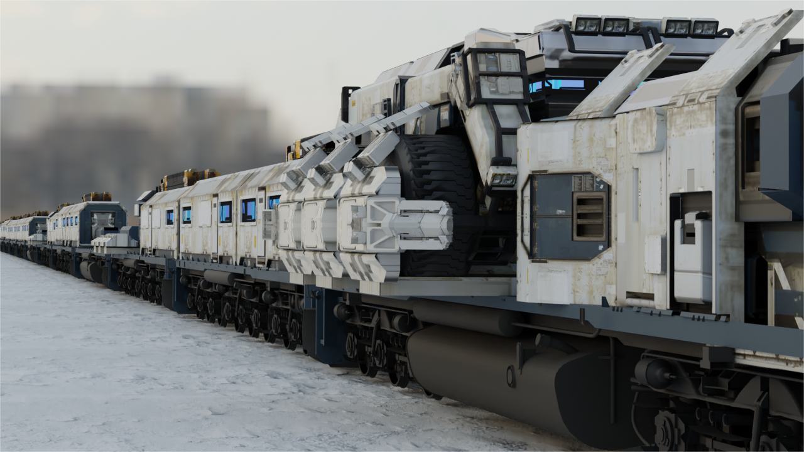

# **Resonance Assistant**

ResonanceAssistant是一个基于[MAAFramework](https://github.com/MaaXYZ/MaaFramework)框架实现游戏[~~唢呐蕾丝~~《雷索纳斯》](https://soli-reso.com/)自动清日常和~~最大化列车跑商收益~~的软件。

基于全新架构的 列车长 小助手。图像技术 + 模拟控制，解放双手！
由 MaaFramework 强力驱动！

什么你问我为好多功能还没实现？~~因为咕咕咕了还没做完~~

已经在做啦！

---

# 免责申明：

## 本项目不会实现任何游戏内付费项目的替代，旨在减少部分无用劳动，提升玩家留存度，保证玩家日活。

~~叠个甲先~~

---

### 当前目标：

- 接入[MAAFramework](https://github.com/MaaXYZ/MaaFramework)实现基础清日常

  - 完善基础管线任务

  - 实现GUI
  
### 长期目标：

- 自动跑商

## 使用说明

#### 开始使用ResonanceAssistant看这里：[快速开始](assets/docs/zh_cn/Start/快速开始.md)

#### 想要参与开发看这里：[开发指南](assets/docs/zh_cn/Develop/开发指南.md)

## 写在后面的话

在开始这个项目之前，我没有任何开发程序的经验。编程也基本不会，很多东西都是摸着石头过河，遇到一点问题就去学一点解决一点。所以开发进度慢，逻辑混乱说明的还请您见谅QAQ。当然如果您能参与开发我将非常乐意！

## 许可证

`ResonanceAssistant` 采用 [`AGPL-3.0`](./LICENSE.md) 许可证进行开源。

## 鸣谢

感谢以下开发者对 ResonanceAssistant 作出的卓越贡献： 

## 讨论

ResonanceAssistant交流群: 752529322
