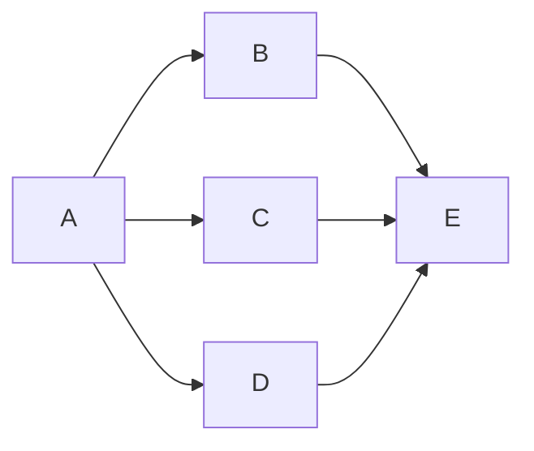

interface.json中`"param"`刚开始可能会让人摸不着头脑，解释在这里：

`"param"`参数会对对应pipeline中的task基于键进行覆盖

作用可以是我创建了几个不同的Task,如图：


其中B，C，D任务我们每次执行任务时只希望它执行其中一个，就可以使用 `"option"` 在不同的 `case` 里面给 Task A 赋予不同的 next 列表。通过调用该任务时候的不同选项控制每次执行的是哪一个。

示例：

```json
{  
    "Task":{
        "name": "Example",
        "entry": "A",
        "option":[
            "Choose_B",
            "Choose_C",
            "Choose_D"
        ]
    },
    "option": {
        "case":[
            {
                "name": "Choose_B",
                "param":{
                    "A":{
                        "next": "B"
                    }
                }
            },
            {
                "name": "Choose_C",
                "param":{
                    "A":{
                        "next": "C"
                    }
                }
            },
            {
                "name": "Choose_D",
                "param":{
                    "A":{
                        "next": "D"
                    }
                }
            }
        ]
    }
}
```
