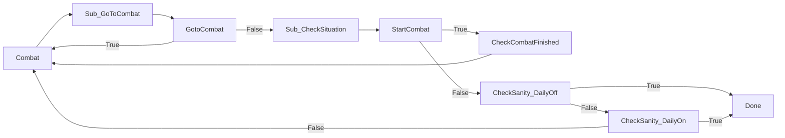

```mermaid
graph LR;
    A[Combat]-->B[Sub_GoToCombat]-->C[GotoCombat]-->|False|D[Sub_CheckSituation]
    C-->|True|A
    D-->E[StartCombat]-->|True|F[CheckCombatFinished]
    E-->|False|G[CheckSanity_DailyOff]-->|True|Z[Done]
    G-->|False|I[CheckSanity_DailyOn]-->|True|Z
    I-->|False|A
    F-->A
```