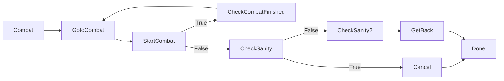

```mermaid
graph LR;
    A[Combat]-->B[GotoCombat]-->C[StartCombat]-->|True|D[CheckCombatFinished]-->B
    C-->|False|E[CheckSanity]-->|True|F[Cancel]-->H[Done]
    E-->|False|G[CheckSanity2]-->I[GetBack]-->H
```